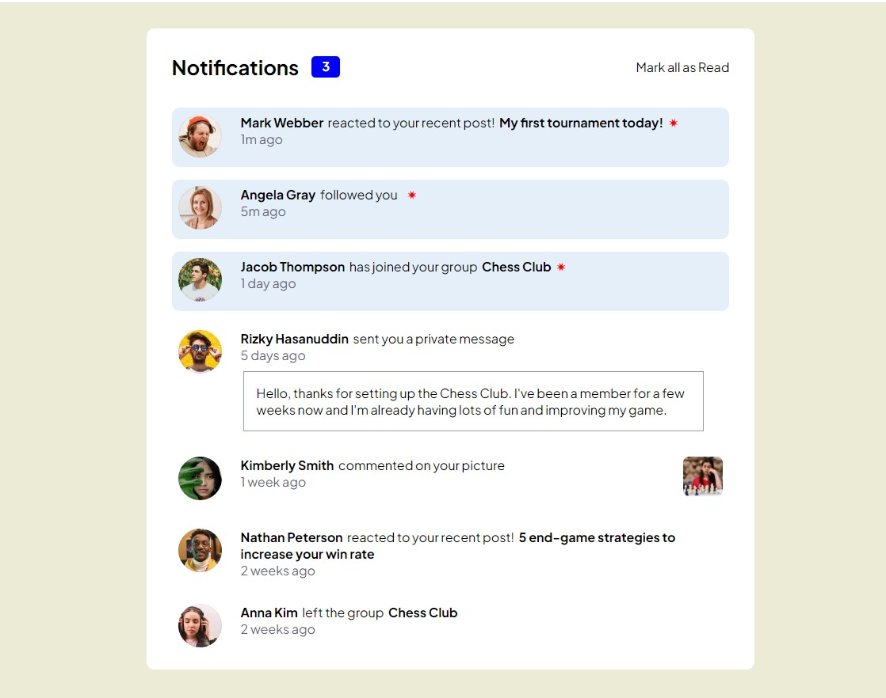

# Frontend Mentor - Notifications page solution

This is a solution to the [Notifications page challenge on Frontend Mentor](https://www.frontendmentor.io/challenges/notifications-page-DqK5QAmKbC). Frontend Mentor challenges help you improve your coding skills by building realistic projects. 

## Table of contents

- [Overview](#overview)
  - [The challenge](#the-challenge)
  - [Screenshot](#screenshot)
  - [Links](#links)
- [My process](#my-process)
  - [Built with](#built-with)
  - [What I learned](#what-i-learned)
  - [Continued development](#continued-development)
  - [Useful resources](#useful-resources)
- [Author](#author)
- [Acknowledgments](#acknowledgments)


## Overview

### The challenge

Users should be able to:

- Distinguish between "unread" and "read" notifications
- Select "Mark all as read" to toggle the visual state of the unread notifications and set the number of unread messages to zero
- View the optimal layout for the interface depending on their device's screen size
- See hover and focus states for all interactive elements on the page

### Screenshot




### Links

- Solution URL: Pending
- Live Site URL: Pending

## My process

### Built with

- Semantic HTML5 markup
- CSS custom properties
- Flexbox
- Vanilla Javascript


### What I learned

Add an event listener for manipulating a sibling element. 

Example: by clicking on the user's name, the background color toggles, and the "red star" shows up or not.

```js

// Set to read state, on individual selection
friendMessages.forEach((item) => {
  let friendName = item.querySelector(".friend-name");
  let markRead = item.querySelector(".mark-read");

  friendName.addEventListener("click", () => {
    item.classList.toggle("read");
    markRead.classList.toggle("read");
    countNotRead();
  });
});
```


### Continued development


Continue improving my coding skills by developing challenging applications, like this one.


### Useful resources


Miscellaneous video tutorials on CSS grid, as well as w3schools.com.


## Author

- Website - [Guillermo Dominguez](https://gdominguez-portfolio.netlify.app)
- Frontend Mentor - [@memominguez](https://www.frontendmentor.io/profile/memominguez)


## Acknowledgments


Thanks to all those who share their knowledge, free of charge, through video tutorials in the youtube platform.
 
